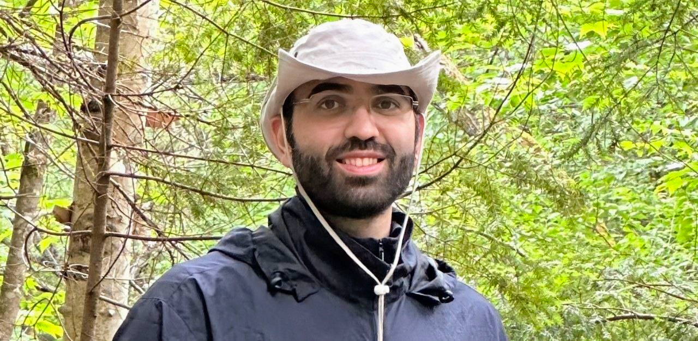

Title: 
URL:
save_as: index.html

    

            
    

    

        <h3>Ph.D. in Astroparticle Physics</h3>
        <ul>
            <li>University of Toronto - 2025.</li>
            <li>SuperCDMS collaboration member.</li>
            <li>Dark matter - cryogenic detectors.</li>
            <li>Simulation - data analysis - statistics.</li>
        </ul>
        <h3>B.Sc. in Physics and Mathematics</h3>
        <ul>
            <li>University of Tehran - 2018</li>
        </ul>
        <h3>Contact</h3>
        <ul>
            <li>Email: atasattari [at] gmail [dot] com</li>
            <li>Happy to be in touch! Please use "GitHub-page" in the title.</li>
        </ul>  
    

<!-- # Hello! This is Ata.  -->
<!--  -->
<!--  -->
<!-- {width=40%; align-items= center} -->

<!-- Ph.D. in Astroparticle physics:

- University of Toronto - 2025.
- SuperCDMS collaboration member.
- Dark matter - cryogenic detectors.
- Simulation - data analysis - statistics.

B.Sc. in physics and mathematics:

- University of Tehran - 2018

Contact:

- atasattari {at} gmail {dot} com
- Happy to be in touch! Please use "GitHub-page" in the title. -->

 
 
 

<!-- Before the physics life:

- Professional swimmer - competed in national youth tournaments in Iran.
- Played Dota2 - reached rank 800 North America -->

<!-- BSc in physics and mathematics | University of Toronto | Dark matter search 

I hold a PhD in physics from the University of Toronto. My projects mostly focused on <u>simulations</u>, <u>data analysis</u>, and  <u>statistics</u> for the dark matter search endeavors of the SuperCDMS collaboration. I was lucky to be supervised by:

- [Miriam Diamond](https://mcdonaldinstitute.ca/miriam-diamond/)
- [Ziqing Hong](https://mcdonaldinstitute.ca/app-opportunities/opportunities/ziqing-hong/)
- [Pekka Sinervo](https://sites.physics.utoronto.ca/pekkasinervo)

Before moving to Canada, I got my BSc in physics and mathematics at the University of Tehran. My BSc project focused on aspects of <u>N-point functions in quantum mechanics</u>. I enjoyed learning from

- [Mahdiyar Noorbala](https://inspirehep.net/authors/1058807?ui-citation-summary=true)

Before my physics life, I was a professional swimmer and won multiple national youth tournaments across Iran. I was also an avid Dota2 player for several years and reached rank 800 in North America during COVID.

 -->

<!-- I defended my PhD in astroparticle physics at the University of Toronto in Dec 2024 under Prof. [Miriam Diamond](https://mcdonaldinstitute.ca/miriam-diamond/), [Ziqing Hong](https://mcdonaldinstitute.ca/app-opportunities/opportunities/ziqing-hong/), and [Pekka Sinervo](https://sites.physics.utoronto.ca/pekkasinervo). My projects primarily focused on simulations, data analysis, and statistical methods:

- A new [measurement](https://journals.aps.org/prd/abstract/10.1103/PhysRevD.105.122002) of the ionization yield in germanium.
- Solar axions interaction rate [model](https://www.snolab.ca/wp-content/uploads/2021/08/SuperCDMS-Axion-like-searches-Ata-Sattari.pdf) for SuperCDMS SNOLAB detectors.
- A search for light dark matter interaction in the lab.
- Development of a novel calibration scheme for silicon cryogenic calorimeters.

I also enjoyed contributing to both the Software and Statistics working groups of the SuperCDMS collaboration:

- Contributed to the development of the first SuperCDMS analysis package in Python under Dr. [Ben Loer](https://www.pnnl.gov/science/staff/staff_info.asp?staff_num=11133) and Prof. [Amy Roberts](https://clas.ucdenver.edu/physics/amy-roberts-phd).
- Provided technical support to construct some statistical inference models in ROOT.
- Gave an introductory lecture on statistics for HEP at the 2024 SuperCDMS Annual Meeting.

Before moving to Canada for my PhD, I got my BSc in physics at the University of Tehran. My BSc project, supervised by Prof. [Mahdiyar Noorbala](https://inspirehep.net/authors/1058807?ui-citation-summary=true), focused on aspects of N-point functions in quantum mechanics.

Before my physics life, I was a professional swimmer and won multiple national youth tournaments across Iran. I have also been an avid Dota2 player for some years and reached rank 800 in North America during COVID.

 
 

    

        
    

    

        <h1><strong>Hello! This is Ata.</strong></h1>
        
I defended my PhD in astroparticle physics at the University of Toronto in Dec 2024 under Prof. <a href="https://mcdonaldinstitute.ca/miriam-diamond/" target="_blank">Miriam Diamond</a>, <a href="https://mcdonaldinstitute.ca/app-opportunities/opportunities/ziqing-hong/" target="_blank">Ziqing Hong</a>, and <a href="https://sites.physics.utoronto.ca/pekkasinervo" target="_blank">Pekka Sinervo</a>. My projects primarily focused on simulations, data analysis, and statistical methods:
        

        <ul>
            <li>A new <a href="https://journals.aps.org/prd/abstract/10.1103/PhysRevD.105.122002" target="_blank">measurement</a> of the ionization yield in germanium.</li>
            <li>Solar axions interaction rate <a href="https://www.snolab.ca/wp-content/uploads/2021/08/SuperCDMS-Axion-like-searches-Ata-Sattari.pdf" target="_blank">model</a> for SuperCDMS SNOLAB detectors.</li>
            <li>A Search for light dark matter interaction in the lab.</li>
            <li>Development of a novel calibration scheme for silicon cryogenic calorimeters.</li>
        </ul>
        

        I also enjoyed contributing to both the Software and Statistics working groups of the SuperCDMS collaboration:
        

        <ul>
            <li> Contributed to the development of the first SuperCDMS analysis package in Python under Dr. <a href="https://www.pnnl.gov/science/staff/staff_info.asp?staff_num=11133" target="_blank">Ben Loer</a>, and Prof. <a href="https://clas.ucdenver.edu/physics/amy-roberts-phd" target="_blank">Amy Roberts</a>.</li>
            <li> Provided technical support to construct some statistical inference models in ROOT.</li>
            <li> Gave an introductory lecture on statistics for HEP at the 2024 SuperCDMS Annual Meeting.</li>
        </ul>
        

        Before moving to Canad for my PhD, I got my BSc in physics at the University of Tehran. My BSc project, supervised by Prof. <a href="https://inspirehep.net/authors/1058807?ui-citation-summary=true" target="_blank">Mahdiyar Noorbala</a>, focused on aspects of N-point functions in quantum mechanics.
        

        Before my physics life, I was a professional swimmer and won multiple national youth tournaments across Iran. I has also been an avid Dota2 player for some years and reached rank 800 in North America during COVID.
    

 -->
